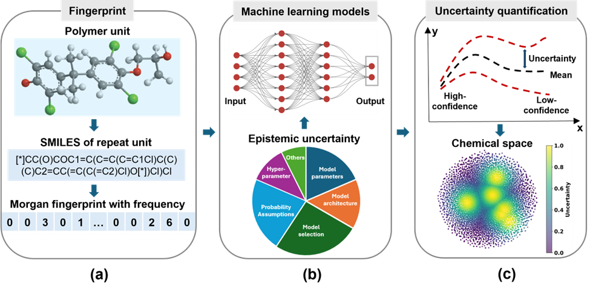
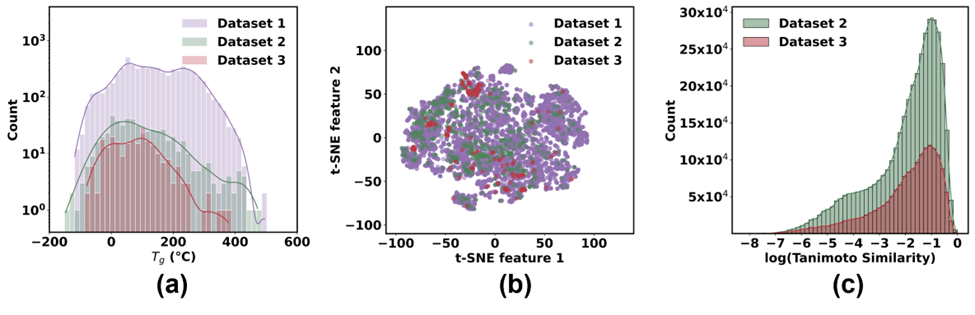
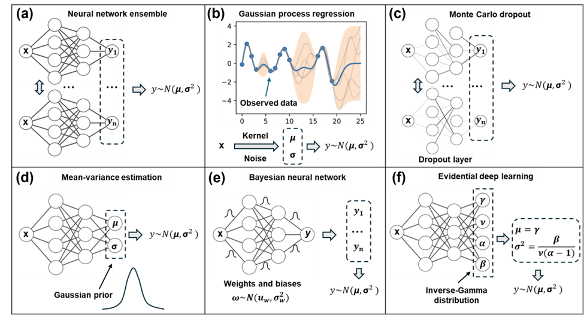

# Uncertainty Quantification in Machine Learning for Glass Transition Temperature Prediction of Polymers
---
**Code repository for the above titled paper**
## Workflow

## Dataset

* Dataset 1: 6097 homopolymers with Tg from PoLyInfo (#https://polymer.nims.go.jp/)
* Dataset 2: 240 homopolymers with Tg from experiment data
* Dataset 3: 566 homopolymers with Tg from MD simulation
* High-Tg polymers (Tg>350℃): 19 high-Tg polymers from experiment data 
## Methods

* Neural network ensemble: Pytorch
* Gaussian process regression (GPR): GPy (#https://github.com/SheffieldML/GPy/tree/deploy)
* Monte Carlo dropout (MCD): Pytorch
* Mean-variance estimation (MVE): Pytorch
* Bayesian neural network (BNN): Pytorch
* Evidential deep learning (EDL): Pytorch, Chemprop(#https://github.com/aamini/chemprop)

### Input
* Morgan fingerprint with frequency: Considering the number of substructures

### Output
* Mean and standard deviations of Tg for homopolyers

## Metrics
* Spearman's rank correlation coefficient
* Calibration
* Sparsification